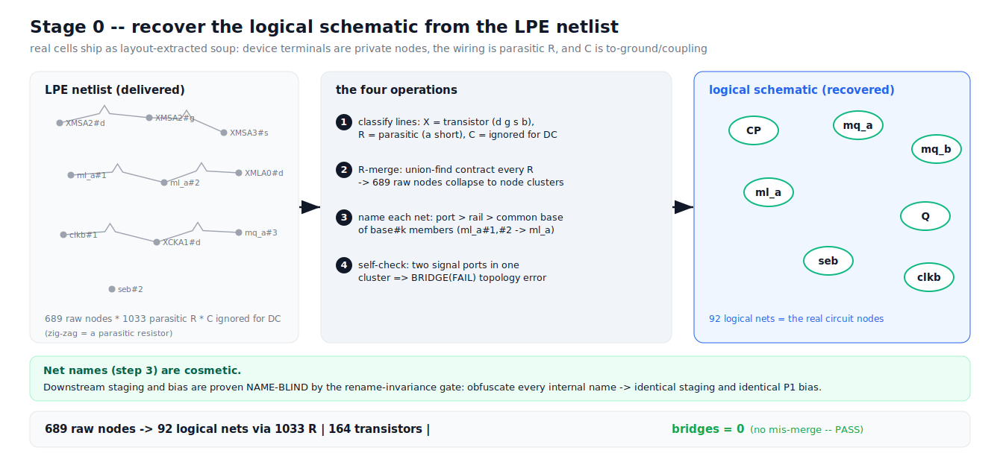

# S0 -- Recover the logical schematic (de-parasitic R-merge)



## The engine's actual output on the sync cell

```
S0 parse: R-merge: 689 raw nodes -> 92 logical nets via 1033 resistors;
          164 transistors; bridges = 0
```

## The problem

Real standard cells are not delivered as clean schematics. They ship as
**LPE (layout parasitic extracted)** netlists:

- every transistor terminal is a **private extracted node** (`XMSA2#d`,
  `XMSA2#g`, ...);
- the actual wiring is not direct -- a metal wire becomes a **chain of tiny
  parasitic resistors** between many intermediate nodes;
- there are also parasitic **capacitors** (to-ground and coupling) that are
  irrelevant to DC connectivity.

So a 4-stage flop arrives as ~700 nodes glued by ~1000 resistors. You cannot
reason about logic until you collapse that back into real circuit nodes.

## How the engine does it

1. **Classify each line.** `X...` = transistor (`d g s b model`); `R...` =
   parasitic resistor (2 nodes); `C...` = capacitor (ignored for connectivity,
   retained as Layer-B data). Here: **164 transistors, 1033 resistors.**
2. **R-merge (the core).** Treat every resistor as a dead short and contract its
   two endpoints with **union-find**. After all 1033 resistors, the **689 raw
   nodes collapse into 92 connected clusters** -- each cluster is one **logical
   net** (a real circuit node).
3. **Name each net.** Cluster contains a port -> use the port name (CP, D, Q...);
   else a rail; else the common base of its `base#k` members (`ml_a#1`,
   `ml_a#2` -> `ml_a`). This name is **cosmetic only** -- see the talking point.
4. **Self-check `bridges`.** If one cluster contains two distinct signal ports,
   a resistor wrongly shorted two nets -> recorded as `BRIDGE(FAIL)`. Here
   **bridges = 0**: the de-parasitic merge is clean.

## Reading the numbers

- **164 transistors** -- right order of magnitude for a 4-stage synchronizer
  with a scan mux, async clear, and an output stage.
- **92 logical nets** -- about 10 are ports + rails, leaving ~82 internal nets to
  feed S1.
- **bridges = 0** -- the health check for this stage. PASS.

## Talking points for the slide

- "We start from the netlist the foundry actually gives you -- extracted soup,
  not a schematic -- and rebuild the real circuit."
- "No PDK, no cell library knowledge: pure graph contraction over the parasitic
  resistors."
- **Key:** the net NAMES (step 3) are decoration. Everything downstream is proven
  name-blind by the rename-invariance gate -- obfuscate every internal name and
  the staging/sensitization come out identical. That is what lets us trust the
  engine on a cell whose internals nobody documented.
