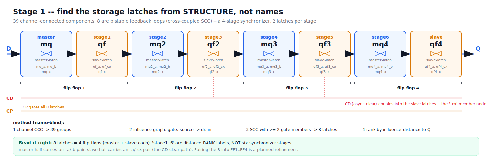

# S1 -- Find the storage latches from STRUCTURE, not names



## The engine's actual output on the sync cell

```
S1 ccc: 39 CCC(s); storage
  master: [mq,  mq_a,  mq_b,  mq_x ]      stage4: [mq3, mq3_a, mq3_b, mq3_x]
  stage1: [qf,  qf_a,  qf_cx, qf_x ]      stage5: [qf3, qf3_a, qf3_cx,qf3_x]
  stage2: [mq2, mq2_a, mq2_b, mq2_x]      stage6: [mq4, mq4_a, mq4_b, mq4_x]
  stage3: [qf2, qf2_a, qf2_cx,qf2_x]      slave : [qf4, qf4_a, qf4_cx,qf4_x]
```

## What this says

- **39 CCC** = the channel-connected-component partition found 39 transistor
  groups. Most are combinational (clock buffers, the scan mux, clear logic, the
  output stage).
- **8 of them are bistable storage loops** -- and that is the result:
  **8 latches = a 4-stage synchronizer x 2 latches per stage.** The engine found
  exactly that, name-blind.

## How CCC works, in detail (the four operations)

1. **Channel-connected components (the 39).** Add an edge between two nets that
   share a transistor source-drain channel; union-find them. That partition is the
   39 CCCs -- "what is galvanically connected through conducting channels." Most
   are combinational (buffers, the scan mux, clear logic, output stage).
2. **Influence graph.** For every transistor add directed edges
   `gate -> drain` and `source -> drain` (what can affect what).
3. **Feedback loops (Tarjan SCC).** A strongly-connected loop in that graph is a
   signal that feeds back on itself = a bistable. Keep only loops with **>= 2
   gate-controlling members** (this drops series-stack internal nodes that are
   drains but never gates). Each surviving loop = one storage latch -> **8 found.**
4. **Rank by distance to Q.** BFS hop-count from each loop to the output; sort
   ascending. Closest = `slave`, farthest = `master`, the rest `stage{...}`.

## "6 stages" is a labeling artifact -- it is 8 latches = 4 flip-flops

With 8 latches the ranker emits: rank 0 -> `slave`, rank 7 -> `master`, and the
**6 in between** -> `stage1..6`. So `8 = master + 6 middle + slave`. A **4-stage
synchronizer = 4 flip-flops = 8 latches** (each flip-flop is a master latch + a
slave latch). The `stageN` names merely rank the middle latches; they do **not**
mean six synchronizer stages. The engine does not yet **pair** the 8 into 4
master/slave flip-flops -- that pairing (FF1..FF4 in the figure) is a planned
refinement. State it plainly so the count is not misread.

## How a "storage latch" is found (name-blind)

A latch holds state in **cross-coupled feedback**. The engine builds an
**influence graph** (gate->drain and source->drain edges) over the internal nets
and looks for a **strongly-connected loop of >= 2 gate-controlling nodes** -- that
is a bistable. No match on `ml_*`/`sl_*`; it is pure topology. Each of the 8
storage elements is one such loop (its `_a`/`_b` or `_a`/`_cx` members are the
cross-coupled pair).

## Roles come from distance, and the chain falls out clean

Roles are assigned by **influence-distance to the output Q** (closest = slave,
farthest = master, the rest ranked between). Sorting the 8 by that rank gives a
perfectly clean master/slave chain:

```
D -> mq -> qf -> mq2 -> qf2 -> mq3 -> qf3 -> mq4 -> qf4 -> Q
     M     S     M      S      M      S      M      S
   \__ flip-flop 1 _/\_ flip-flop 2 _/\_ flip-flop 3 _/\_ flip-flop 4 _/
```

- `mq*` nets (with a `_b` node) are the **master** latch of each stage;
- `qf*` nets (with a `_cx` node) are the **slave** latch of each stage.

The clean monotonic ordering is itself evidence the derivation is structural.

## One honest, useful detail

The slave latches carry a `_cx` member where masters carry `_b`. That extra node
is almost certainly the **CD async-clear** coupling into the output latches (to
confirm against conduction). It matters: the measured arc is CD's **minimum pulse
width**, and how fast a clear reaches Q depends on what these stages were holding
-- which is exactly the worst-case initialization problem the next steps attack.

## Honest caveats for the talk

- The labels `stage1..6` are **distance-rank** names, not yet grouped into
  per-stage master/slave **pairs**. Pairing them (FF1..FF4) is a small, planned
  refinement (figure already shows the grouping).
- This is the structure on the REAL server-side netlist. The repo's CI fixture is
  a single-stage DFF; the rename-invariance gate proves the MECHANISM there so the
  8-stage result here is trustworthy.

## Talking points for the slide

- "The engine doesn't recognize a flop by its name -- it finds memory by finding
  feedback loops, and it found all 8 in a cell it had never seen."
- "It even ordered them correctly along the data path, master to slave, with zero
  naming hints."
- "And it already sees the clear path into the slaves -- the hook for proving the
  worst-case clear timing."
