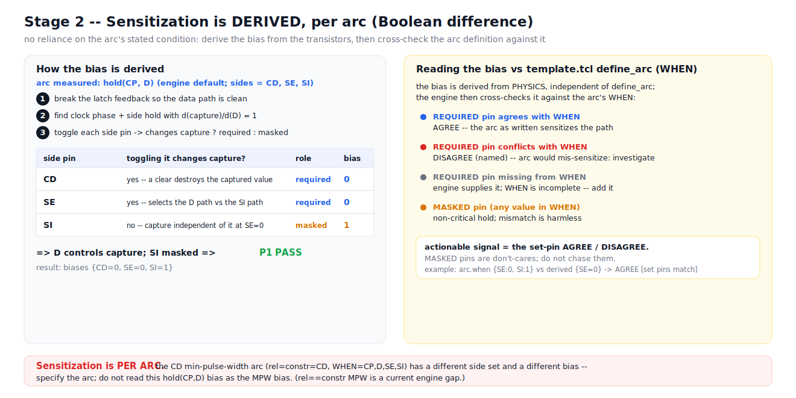

# S2 -- Sensitization is DERIVED, per arc (Boolean difference)



## The engine's actual output (default arc)

```
S2 sensitize: biases {CD=0, SE=0, SI=1}   P1 = PASS
```

Important: this run used the engine's **default arc, `hold(CP, D)`**
(`engine/run.py` `--netlist` mode hardcodes `arc_type=hold, rel=CP, constr=D`).
So this bias is the sensitization for **hold(CP -> D)**, not for the CD
min-pulse-width arc. Sensitization is **per arc** (see the warning banner).

## How the bias is derived (name-blind, physics-only)

The measured arc captures the constraint pin (here D) through the cell.
Sensitization holds the non-measured inputs static so that path is the only live
capture path. The engine derives it **functionally**, by switch-level Boolean
difference (stdlib, no SAT):

1. break the latch feedback (the Stage-1 storage cores) so the data path is clean;
2. find a clock phase + a static side-pin assignment under which toggling the
   constraint pin changes the captured (master) node: `d(capture)/d(D) = 1`;
3. classify each side pin by toggling it under that bias:
   - **REQUIRED (set)** -- toggling it changes capture (e.g. SE selects D vs SI);
   - **MASKED** -- toggling it never changes capture (e.g. SI; the competing path
     is off, so its static value is non-critical).

For `hold(CP, D)`: CD=0 (a clear would destroy capture), SE=0 (selects the D
path), SI=1 (masked under SE=0) -> D controls capture, SI masked -> **P1 PASS**.

## Reading the bias vs `template.tcl` `define_arc` (WHEN)

The bias is derived from **physics**, independent of `define_arc`. The engine then
cross-checks it against the arc's WHEN and reports `arc_check`:

| Situation | What it means | What to do |
|-----------|---------------|------------|
| REQUIRED pin **agrees** with WHEN | AGREE -- arc sensitizes the path | nothing |
| REQUIRED pin **conflicts** with WHEN | DISAGREE (named) -- arc would mis-sensitize | investigate (bad arc def or a polarity to confirm) |
| REQUIRED pin **missing** from WHEN | engine supplies it; WHEN is incomplete | add it to the arc def |
| **MASKED** pin (any WHEN value) | non-critical hold | ignore -- do not chase it |

So when `define_arc` does not fully satisfy the bias, the **actionable signal is
the set-pin AGREE/DISAGREE** -- not the masked pins. A required pin the engine
derived but `define_arc` omitted is physically necessary; trust it. A required pin
that conflicts is the real red flag.

## Honest caveat for the talk

`stage2` is written for `rel != constr` ("the constraint pin controls capture").
The real demo arc is CD min-pulse-width with **`rel == constr == CD`**, side pins
`CP/D/SE/SI` held at WHEN. That degenerate case is **not yet handled** -- it is a
concrete gap the sync work (STEP 1) must close. Do not present the hold(CP,D) bias
as the MPW bias.

## Talking points for the slide

- "We don't take the arc's stated condition on faith -- we derive the bias from
  the transistors and then check the arc definition against it."
- "Required vs masked is decided by a toggle test, not by a table."
- "If the arc's `define_arc` is incomplete or wrong, the engine tells you which
  pin and why -- that's the audit a template-only flow can't give you."
