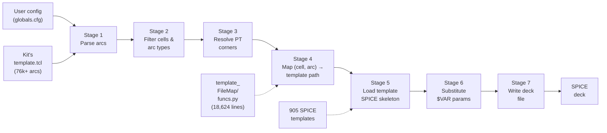
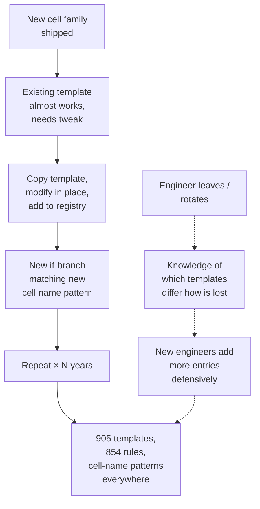
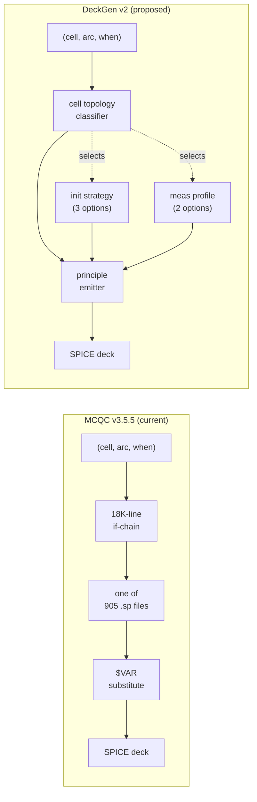

# MCQC Problem Statement & DeckGen v2 Direction

> A consolidated report combining DeckGen Phase 1 archaeology (MCQC pipeline
> reverse-engineering) and Phase 1.5 audit (full template corpus survey).
>
> Audience: technical stakeholders evaluating whether DeckGen v2 should
> replace MCQC's deck-generation flow with a principle-driven emitter.
>
> Status: Phase 1.5 complete. v2 architecture validated by data; prototype
> not yet built.

---

## 0. Executive Summary

MCQC (`scld__mcqc.py` v3.5.5) is the production SPICE deck generator for
TSMC standard-cell library characterization. It maintains **905 hand-tuned
SPICE templates** and a **18,624-line if-chain** (`templateFileMap/funcs.py`)
that selects which template to use for each (cell, arc, condition) triple.

This report establishes three things:

1. **What MCQC actually does** — a 7-stage pipeline that resolves cells,
   selects templates by name pattern, and substitutes parameters.

2. **Why its complexity is misleading** — the 905 templates are not 905
   physically distinct measurement methodologies. They are combinatorial
   expansions of a small set of orthogonal axes (3 init strategies × 2
   criteria × ~20 parameters), encoded as separate files for historical
   reasons.

3. **What DeckGen v2 should do instead** — replace template *selection*
   with deck *emission*: a principle-driven generator that takes
   (cell topology, arc spec, condition) and synthesizes the SPICE deck
   from physics primitives, reducing 905 files + 18K-line if-chain to
   roughly 10–15 emitter rules + a parameter schema.

The data backing claim 2 is in §3. The architectural argument for claim 3
is in §4–5.

---

## 1. What MCQC Does (Pipeline Overview)

MCQC takes user configuration plus a Liberate characterization kit
(`template.tcl`) and produces SPICE decks ready for HSPICE simulation.



### The 7 stages, briefly

| Stage | Purpose | Key complexity |
|---|---|---|
| 1. Parse `template.tcl` | Tokenize 76k+ `define_arc` statements (ALAPI format), extract (cell, type, related_pin, vector, when) tuples | Implicit `type='combinational'` default for arcs without `-type` |
| 2. Cell + arc-type filter | Keep only arcs in user's `cell_pattern_list` AND `valid_arc_types_list` | Silent drops if filter mismatch |
| 3. PT corner resolution | Cross product of process / voltage / temperature corners | — |
| 4. Template selection | Match (cell_pattern, arc_type, related_pin, dir, constr_dir, when) against 18,624-line if-chain → return template path | This is the production complexity hotspot |
| 5. Template load | Read selected `.sp` file from disk | — |
| 6. Variable substitution | Replace `$VAR` placeholders with cell-specific / corner-specific values | ~20 named variables; some are universal, some optional |
| 7. Write output | Emit final deck to user's output directory | — |

The architectural weight sits in **Stage 4** (selection logic) and the
**905 templates** that Stage 5 consumes. Stages 1–3, 6, 7 are
parameterized data flow; they don't need rewriting.

---

## 2. The Surface Complexity

What new engineers see when first reading MCQC:

```
templateFileMap/funcs.py:
   18,624 lines
   688 HSPICE selection rules + 166 Spectre rules  =  854 total rules
   Pattern: long if-elif chain matching cell name globs

templates/:
   905 .sp files
   Organized by directory: hold/, setup/, nochange/, min_pulse_width/,
                            non_seq_hold/, non_seq_setup/, delay/,
                            nochange_low_high/, nochange_low_low/,
                            nochange_high_low/
```

This **looks** like 905 physically distinct measurement methodologies,
each requiring bespoke SPICE engineering. That impression is wrong, and
the rest of this report shows why.

---

## 3. The Real Structure (Audit Data)

A full audit of all 905 templates was performed in Phase 1.5 (script
`global_audit.sh`). The findings reduce the apparent complexity by an
order of magnitude.

### 3.1 Init strategy: three mutually-exclusive options

How each template initializes internal state nodes before transient
analysis:

```
   ┌─────────────────────────────────────────────────────────┐
   │  905 templates                                          │
   │                                                         │
   │  ┌──────────────┐  ┌──────────────┐  ┌──────────────┐   │
   │  │  .ic only    │  │ .nodeset     │  │  NEITHER     │   │
   │  │  175 (19%)   │  │ only         │  │  604 (67%)   │   │
   │  │              │  │ 126 (14%)    │  │              │   │
   │  │  Forced      │  │ DC-solve     │  │  No SPICE    │   │
   │  │  internal    │  │ hint;        │  │  init;       │   │
   │  │  state       │  │ transient    │  │  metadata    │   │
   │  │  throughout  │  │ can override │  │  via DONT_   │   │
   │  │  transient   │  │              │  │  TOUCH_PINS  │   │
   │  │              │  │ Paired with  │  │  drives      │   │
   │  │  Used by:    │  │ .options     │  │  simulator   │   │
   │  │  EDF, MB,    │  │ ptran_       │  │              │   │
   │  │  DIV4,       │  │ nodeset=1    │  │  Used by:    │   │
   │  │  latch_S,    │  │              │  │  bulk of     │   │
   │  │  gclk_*      │  │ Used by:     │  │  hold,       │   │
   │  │              │  │ retention    │  │  setup,      │   │
   │  │              │  │ MPW, sync2-6 │  │  nochange,   │   │
   │  │              │  │              │  │  non_seq     │   │
   │  └──────────────┘  └──────────────┘  └──────────────┘   │
   │                                                         │
   │  BOTH (.ic AND .nodeset):  0  templates                 │
   │                                                         │
   └─────────────────────────────────────────────────────────┘
```

**Key finding**: the three strategies are **disjoint** (intersection = 0).
Init strategy is therefore a clean three-way classifier, not a
combinatorial space.

### 3.2 Constraint criteria: only two

```
   ┌────────────────────────────────────────┐
   │  CONSTR_CRITERIA values across corpus  │
   │                                        │
   │     pushout   ████████████████  382    │
   │     glitch    ██████████        233    │
   │                                        │
   │  (290 templates omit CONSTR_CRITERIA;  │
   │   criteria implicit from directory)    │
   └────────────────────────────────────────┘
```

There are no other measurement criteria. The choice between pushout and
glitch is binary.

### 3.3 Transient analysis: 1 structure, 43 surface forms

Every template has exactly **one** `.tran` line. The 43 surface variants
collapse to 3 structural shapes:

| Shape | Frequency | Example |
|---|---:|---|
| Plain transient | 31 + 22 | `.tran 1p 5000n` |
| Monte-Carlo sweep | 405 + 126 | `.tran 1p 5000n sweep monte=1` |
| Optimization sweep | ~250 across 30+ variants | `.tran 1p 5000n sweep OPTIMIZE=OPT1 results=<MEAS_LIST> model=optmod` |

The 30+ optimization-sweep variants differ only in the `results=<MEAS_LIST>`
field, which is **derived from which measurements the template uses** — not
an independent design axis.

### 3.4 THANOS metadata: 3 fields, all derivable

Templates expose three header fields:

| Field | Templates | Distinct values | Derived from |
|---|---:|---:|---|
| OPT_RESULTS | 615 | ~12 | Subset of declared `.meas` names |
| CONSTR_CRITERIA | 615 | 2 | pushout / glitch (Sec. 3.2) |
| CONSTR_PIN_PARAM | 613 | 4 | Constrained-pin time index |

None of these is an independent input. All three are functions of
measurement spec + parameter list.

### 3.5 Includes: universal `$VAR` placeholders

Every template's `.inc` directives go through three universal placeholders:

```
905 .inc '$WAVEFORM_FILE'
905 .inc '$NETLIST_PATH'
905 .inc '$INCLUDE_FILE'
126 .inc '/CAD/.../std_wv_c651.spi'   (hardcoded; only retention MPW)
```

The single hardcoded path in 126 templates correlates exactly with the 126
`.nodeset`-using templates, suggesting paired usage tied to retention
characterization.

### 3.6 Parameter schema: ~20 names

The complete `.param` vocabulary across the corpus:

| Universal (905/905) | Common (>400/905) | Sparse (<100/905) |
|---|---|---|
| vdd_value | constrained_pin_t01 (857) | search_window (126) |
| vss_value | constr_pin_slew (856) | related_pin_t06–t19 (4–48) |
| rel_pin_slew | opt_ub / opt_lb / opt_init (848) | |
| max_slew | related_pin_t02 (411) | |
| cl | related_pin_t03 (401) | |
| related_pin_t01 | constrained_pin_t02 (397) | |
| | related_pin_t04 (386) | |
| | constr_pin_offset (348) | |
| | related_pin_t05 (260) | |

**Six parameters are universal**. The rest scale with arc complexity
(multi-stage sync depth, multi-data-input cells). The full input schema
for *any* template is bounded at roughly 20 named parameters.

### 3.7 DONT_TOUCH_PINS: bounded vocabulary

88 distinct full DONT_TOUCH_PINS strings exist, but they are combinations
of a small pin-token universe (~60 tokens). Top tokens:

```
SI(90), DA1/DA2/DB1/DB2(90 each), DC1/DC2/DD1/DD2(84 each),
D(69), CD(61), SE(52), CP(51), SDN(49),
Q1..Q8(40-44 each), Q9..Q12(23 each),
SCANCLKEN(29), CLKEN(23), WWL0/WWL0_N(20 each),
FSCAN_CLKEN(19), FSCAN(19), FPM(19), CDN(19),
... ~40 more, each with single-digit frequency
```

This is a finite, enumerable set tied directly to standard-cell pin
naming conventions.

### 3.8 Multi-backend reality

Most templates target HSPICE syntax. A subset under
`delay/hold/template__*.thanos.sp` uses **Cadence Spectre** syntax:

```
simulator lang=spectre
SetOption1 options reltol=1e-4 mdloutputfiletype=none
simulator lang=spice
tranIter tran stop=5000n
```

These appear primarily in the AO22 family. Exact Spectre count was not
enumerated in this audit but the existence is confirmed.

### 3.9 What collapses out

Putting it all together:

```
   APPARENT complexity                  ACTUAL design space
   ─────────────────                    ───────────────────

   905 SPICE template files       →     1 emitter +
                                        3 init strategies +
                                        2 measurement profiles +
                                        ~20 parameters +
                                        2 backends (HSPICE / Spectre)

   18,624-line if-chain           →     a cell-topology classifier
                                        feeding the emitter
                                        (~30-50 classification rules
                                         estimated, not yet validated)

   854 selection rules            →     ~10-15 emitter rules
                                        (estimate; needs prototype to confirm)
```

The compression ratio is roughly **60×** on file count, **1000×** on
selection-rule count. This is the central data finding.

---

## 4. Why MCQC Got This Big

MCQC's 905-template + 18K-rule design is **not** the natural shape of the
problem — it's the cumulative shape of a decade-plus of incremental
engineering decisions, each locally rational, that compound into systemic
complexity.



This pattern — **template-per-special-case** — is reasonable when:
- You have <100 cell families
- The team that wrote the templates is still around
- You ship a new library every 2 years

It breaks when:
- The corpus exceeds what one engineer can hold in their head (~200 templates)
- The team rotates faster than the codebase ages
- You ship libraries continuously

MCQC is now in the second regime. The `.thanos.sp` Spectre branch
appearing only in AO22 is a typical artifact: someone needed Spectre for
that specific cell family, added a parallel template, and no one
generalized the change.

---

## 5. The DeckGen v2 Direction

### 5.1 Architectural shift: select → emit



MCQC: input → lookup → file → substitute → output.
v2: input → classify → emit-from-principles → output.

The MCQC path stores all knowledge in **files**. The v2 path stores
knowledge in **code that synthesizes files**.

### 5.2 What the v2 emitter looks like

Conceptual signature:

```python
def emit_deck(
    cell_topology: CellClass,         # MB, EDF, DIV4, latch, retn, ...
    arc_spec: ArcSpec,                # arc_type, related_pin, dirs, when
    init_strategy: InitStrategy,      # NoInit | ICBlock | NodesetBlock
    meas_profile: MeasurementProfile, # Pushout | Glitch
    params: ParamDict,                # vdd, vss, slews, loads, t-indices
    backend: Backend = HSPICE,        # HSPICE | Spectre
) -> str:                             # complete SPICE deck text
    ...
```

This is one function with 6 inputs, not a 905-file lookup table. The
inputs are exactly what Sections 3.1–3.7 identified as the orthogonal
axes of the problem.

### 5.3 Estimated v2 footprint

| Component | Count | Source |
|---|---:|---|
| Init strategy builders | 3 | §3.1 |
| Measurement profile builders | 2 | §3.2 |
| `.tran` emitter | 1 | §3.3 |
| THANOS header emitter | 1 | §3.4 |
| Include block emitter | 1 | §3.5 |
| Parameter binding | 1 | §3.6 |
| Cell topology classifier | ~30–50 rules | §3.7 + B-doc 8 categories (Phase 1.5) |
| Backend emitter (HSPICE) | 1 | §3.8 |
| Backend emitter (Spectre) | 1 | §3.8 (deferred) |

Total: ~10 emitter components + ~30–50 classifier rules. Estimate is
unproven until a prototype exists; the audit data supports the order of
magnitude.

### 5.4 Risk: where the estimate could be wrong

Three places the audit didn't fully verify:

1. **vdd/vss assignment in `.ic` blocks**: appears derivable from cell
   topology (master/slave latch nodes, divider stages), but only verified
   for one sub-family. MB / EDF / DIV4 / latch_S have not been
   independently checked.

2. **126 `.nodeset` ↔ 126 `.options ptran_nodeset=1` pairing**: counts
   match exactly, suggesting required co-occurrence, but file-level
   pairing not verified.

3. **43 `.tran` variants**: spot-checked as parameterized but not
   exhaustively walked.

These are addressable in the v2 prototype phase, not blocking
architectural decisions.

---

## 6. What the Phase 1.5 Audit Actually Measured

For traceability, here is the exact methodology used to produce §3.

| Section | Method | Output |
|---|---|---|
| 3.1 | `grep -lr` for `^\.ic` and `^\.nodeset`, then `comm -12` for intersection | 175 / 126 / 0 / 604 |
| 3.2 | `grep "CONSTR_CRITERIA"` + value extraction | 382 pushout, 233 glitch |
| 3.3 | `grep "^\.tran"` then `sort | uniq -c` | 43 distinct lines, 1 per template |
| 3.4 | Field-extraction grep on `^\* FIELD \|` pattern | 3 fields, per-field value enumeration |
| 3.5 | `grep "^\.inc"` with filename normalization | 4 distinct patterns |
| 3.6 | `grep "^\.param"` + parameter-name extraction | ~25 distinct parameters, frequency-ranked |
| 3.7 | `grep DONT_TOUCH_PINS` + comma-split tokenization | 88 distinct values, ~60 distinct pin tokens |
| 3.8 | `grep "simulator lang=spectre"` | Confirmed presence in `.thanos.sp` files |

Source script: `global_audit.sh`. Raw output: `global_audit.txt`.
Both archived in branch `feat/foundation-closure`.

---

## 7. Open Questions for Stakeholder Review

Before v2 prototype begins, three decisions need stakeholder alignment:

1. **Should v2 ship alongside v1 or replace it?**
   Recommendation: alongside, gated by `--engine principle` flag. v1
   stays default until a 20-cell regression suite passes byte-equal on v2.

2. **Spectre backend: phase 2 or phase 3?**
   Recommendation: phase 3. HSPICE is ~99% of corpus; Spectre is a known
   contained subset (AO22 family). v2 phase 2 declares it explicitly
   out of scope.

3. **What happens to `templateFileMap/funcs.py`?**
   Recommendation: kept as escape hatch. If v2 emitter cannot handle a
   cell, fall back to v1 lookup. Over time, escape-hatch usage tracks
   the residual empirical complexity that resists principle-encoding.

---

## 8. Appendix: Where to Look in the Code

| Concern | File / Path |
|---|---|
| MCQC pipeline entry | `scld__mcqc.py` |
| Selection logic | `templateFileMap/funcs.py` (18,624 lines) |
| Arc parsing | `charTemplateParser/funcs.py` (line 477-482 for `combinational` default) |
| Arc validation | `qaTemplateMaker/funcs.py` (line 750-764 for delay expansion) |
| Phase 1 archaeology | `docs/mcqc_archaeology.md` |
| Phase 1.5 audit data | `docs/foundation/A_*.md` through `E_*.md` |
| Phase 1.5 raw audit | `docs/foundation/global_audit.txt` |
| DeckGen v1 (parity) | `core/resolver.py`, `core/deck_builder.py`, `config/template_registry.yaml` |
| DeckGen v2 (proposed) | `core/principle_emitter/` (does not yet exist) |

---

## 9. One-Slide Summary

```
┌─────────────────────────────────────────────────────────────┐
│  MCQC PROBLEM IN ONE PICTURE                                │
│                                                             │
│  Surface complexity:                                        │
│    905 SPICE templates                                      │
│    18,624-line if-chain                                     │
│    854 cell-pattern → template rules                        │
│                                                             │
│         │                                                   │
│         │  audit reveals                                    │
│         ▼                                                   │
│                                                             │
│  Actual complexity:                                         │
│    3 init strategies (mutually exclusive)                   │
│    2 measurement criteria (pushout, glitch)                 │
│    1 .tran structure (3 surface shapes)                     │
│    3 THANOS metadata fields (all derivable)                 │
│    ~20 named parameters                                     │
│    2 simulator backends (HSPICE primary)                    │
│                                                             │
│  v2 replacement:                                            │
│    1 emitter function                                       │
│    ~10 components + ~30-50 classifier rules                 │
│    Compression: 60× on files, 1000× on rules                │
│                                                             │
└─────────────────────────────────────────────────────────────┘
```

---

*End of report.*
