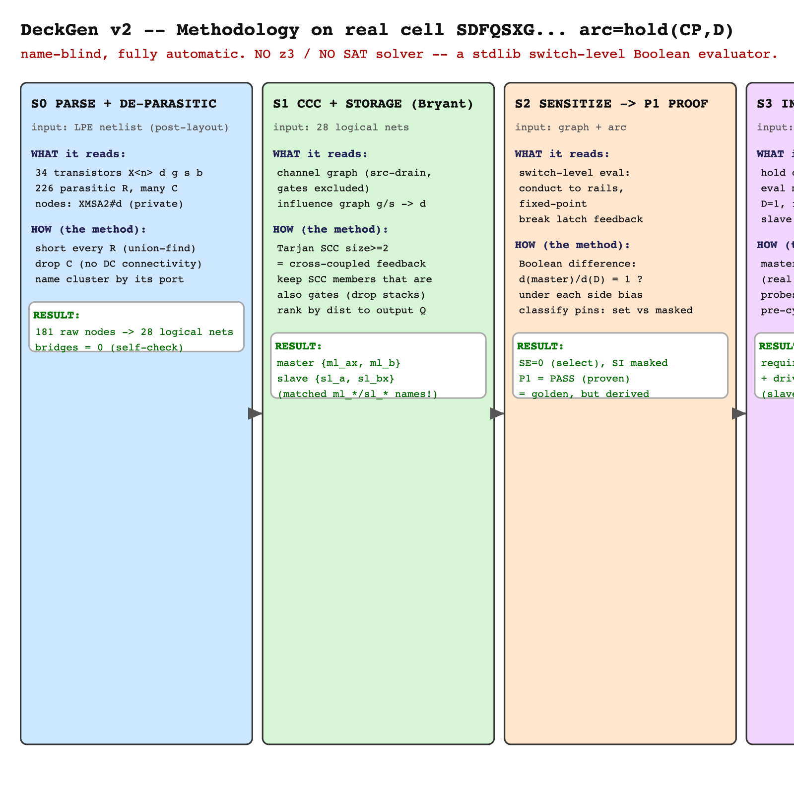
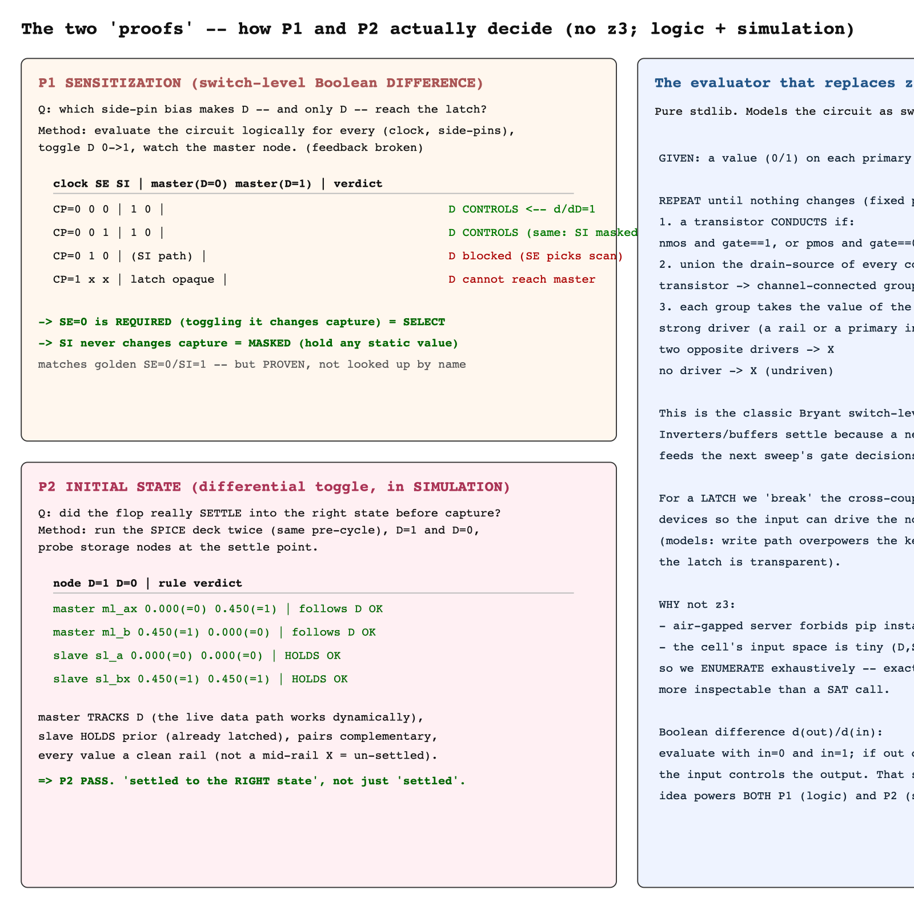

# DeckGen v2 -- Methodology (step by step)

*A walk-through you can read and explain by hand. Every step says WHAT it reads,
HOW it decides, and what it produced on the real cell.*
*Validated on real cell `SDFQSXG0MZD1BWP130HPNPN3P48CPD`, arc `hold(CP, D)`.*

---

## TL;DR -- one idea runs through everything

> **Boolean difference** -- `d(out)/d(in)`: set the input to 0 and to 1; if the
> output changes, the input *controls* the output. We apply this idea in the
> **logic layer** (to prove sensitization, P1) and in the **silicon layer** (to
> verify initial state, P2). Plus union-find to de-parasitize the netlist (S0)
> and Tarjan SCC to find storage structurally (S1). All pure-Python stdlib,
> name-blind, exhaustive and inspectable.

### Important correction: there is **no z3 / no SAT solver**
An early survey note said "ADOPT z3". When the air-gapped server turned out to
forbid pip-from-internet, that was reversed: the engine uses a **hand-written
switch-level Boolean evaluator** (`engine/switchlevel.py`, ~50 lines, stdlib).
Because the cell's primary-input space is tiny (D, SI, SE, CP) we **enumerate
exhaustively** -- exact, and more inspectable than a SAT call. Say
"switch-level evaluator + enumeration", not "z3", when explaining this work.

---

## Figure 1 -- the pipeline on the real cell



## Figure 2 -- the two proofs, and the evaluator that replaces z3



---

## The evaluator (understand this first -- S2/S3/P2 all use it)

**Based on:** Bryant's switch-level model (treat the circuit as a network of
switches, not as equations). `engine/switchlevel.py`:

```
GIVEN a value 0/1 on each primary input
REPEAT until nothing changes (fixed point):
  1. a transistor CONDUCTS if   nmos and gate==1   or   pmos and gate==0
  2. union the drain-source of every conducting transistor
        -> channel-connected groups
  3. each group takes the value of its unique strong driver (a rail or a
     primary input);  two opposite drivers -> X;  no driver -> X
```

Inverters/buffers settle because a net's new value feeds the next sweep's gate
decisions. For a **latch** we "break" the cross-coupled keeper devices so the
input can drive the storage node cleanly (models: the write path overpowers the
keeper while the latch is transparent).

---

## S0 -- Parse + de-parasitic  (`stage0_parse.py`)

**Reads:** the LPE (post-layout) netlist. Transistor terminals are private
extracted nodes (`XMSA2#d`); connectivity is carried entirely by parasitic `R`;
`C` is to-ground/coupling and irrelevant to DC connectivity.

**How:**
1. parse `X` transistors and `R` resistors; ignore `C`.
2. **short every R** and union-find contract its two nodes -> each cluster of
   nodes = one logical net.
3. name a cluster by the **port** it contains, else by the common `netbase` of
   its `netbase#k` nodes (`Xdev#pin` device-pin nodes do not name a net).

**Self-check:** a cluster holding two distinct signal ports means an R bridged
two nets -> recorded as a `BRIDGE(FAIL)` derivation.

**Real result:** `181 raw nodes -> 28 logical nets via 226 resistors; 34
transistors; bridges = 0`.

---

## S1 -- CCC + storage nodes  (`stage1_ccc.py`)  -- the name-blind step

**Reads:** the 28 logical nets + their transistors.
**Based on:** state is held in **cross-coupled feedback**; structurally that is a
cycle in the gate/source -> drain "influence" graph.

**How:**
1. build the influence graph (directed edges `gate->drain` and `source->drain`).
2. **Tarjan strongly-connected components**; an SCC of size >= 2 is a feedback loop.
3. intersect each SCC with the set of **gate nets** -- a true storage node both
   *is driven* (a drain) and *controls* (a gate); tristate series-stack nodes are
   drains/sources only, so they drop out.
4. label master/slave by **BFS distance to the output Q** (closest = slave;
   distance-from-inputs fails because the clock gates both latches equally).

**Real result:** `master {ml_ax, ml_b}`, `slave {sl_a, sl_bx}` -- derived with no
name matching, yet landing exactly on the `ml_*`/`sl_*` naming.

---

## S2 -- Sensitization + P1 proof  (`stage2_sensitize.py`)

**Reads:** the device graph + the arc.
**Based on:** Boolean difference over the switch-level evaluator (Figure 2, left).

**How:**
1. break the latch feedback so the data path is clean.
2. for each clock phase and each static assignment of the side pins, evaluate
   with `D=0` and `D=1`. If the master node differs -> **D controls capture**
   (`d(master)/d(D)=1`).
3. classify each side pin under that bias: toggling it never changes capture ->
   **masked** (e.g. `SI`); toggling it does -> **required select** (e.g. `SE`).
4. cross-check against the arc's `when` string.

**Real result:** `SE=0` (select), `SI` masked -> **P1 = PASS**. Equal to the
golden deck's `SE=0/SI=1`, but **derived and proven**, and `AGREE` with `when`.

---

## S3 -- Initialization (how the initial state is determined)  (`stage3_initialize.py`)

The initial state is fixed in three parts, each on a different basis:

**(1) captured value -- by hold convention.**
`constr_dir = fall` => `D = 1` just before the capturing edge
(`cap = 1 if constr_dir=='fall' else 0`). A stated convention (user-confirmed).

**(2) master initial state -- EVALUATED.**
With feedback broken, evaluate the switch-level model at `{clock=transparent
phase, D=cap, plus the P1 side biases}`. The master's written node takes the
value it actually receives through the data path; its cross-coupled complement is
the inverse.
*Real cell: `ml_ax = 0` (not 1!) -- there is one inversion between D and the
storage node, which the evaluator computes automatically; `ml_b = 1`.*

**(3) slave initial state -- LOGICAL ARGUMENT, polarity deferred to P2.**
The slave must hold the **prior** value (complement of captured) so the capture
produces an observable Q transition. A stateless evaluator cannot compute a
latch's held value across the opaque clock phase -- that is exactly what P2's
simulation verifies. So the slave bit is given (complementary) but marked
**TENTATIVE**, to be pinned by P2.

**(4) probes + drive-and-settle plan.**
Probes map back to real extracted nodes (`x1.<net#k>`). Pre-cycle: drive `D=prior`
for a full clock cycle to load the prior value, then `D=cap` to capture.

---

## P2 -- Simulate + verify the initial state  (`sim.py`)  -- the load-bearing proof

**Based on:** the same Boolean-difference idea, now in silicon (Figure 2,
bottom-left).

**How:** build a runnable HSPICE deck (reusing the golden `.inc` model/netlist/
waveform), run it **twice** with `D=1` and `D=0` under the **same** pre-cycle, and
probe the storage nodes at the settle point. P2 PASS iff:
- **master FOLLOWS D** (its bit differs between the two runs),
- **slave HOLDS** (its bit is the same between the two runs),
- every node is a **clean rail** 0/1 (a mid-rail value = an un-settled X = fail),
- each cross-coupled pair is **complementary**.

This is robust to inversion parity and also pins the slave polarity S3 left
tentative.

**Real result (ss/0.45V/-40C):**

| node | D=1 | D=0 | rule | verdict |
|------|-----|-----|------|---------|
| master `ml_ax` | 0.000 (=0) | 0.450 (=1) | follows D | OK |
| master `ml_b`  | 0.450 (=1) | 0.000 (=0) | follows D | OK |
| slave `sl_a`   | 0.000 (=0) | 0.000 (=0) | holds | OK |
| slave `sl_bx`  | 0.450 (=1) | 0.450 (=1) | holds | OK |

=> **P2 PASS on real silicon.** "Settled into the *right* state", not merely
"settled". This is the property the incumbent (MCQC) flow cannot provide.

### Why "settle time" is not the contribution
Choosing a long-enough settle window (20 ns at this slow corner) is hygiene, not
novelty -- and the incumbent's pre-cycle does the same drive-and-settle. The
contribution is everything around it: deriving **which** state to settle into
(name-blind), **which** nodes to probe (structural), and **proving** the flop
reached the *correct* state (differential check) rather than assuming it did. A
node stuck at a mid-rail value (as in the first, under-settled run) is exactly
the silent error this catches.

---

## What is reused vs. novel (honest)

- **Reused / standard:** SPICE-style parsing, union-find, Tarjan SCC, the
  switch-level evaluation model, settle-time tuning. None of these are claimed.
- **Novel:** the *composition* -- a closed evidence chain from transistor
  topology to a runnable, self-proving deck (P1 logic proof + P2 silicon proof),
  name-blind, every derived value carrying its reason -- and its validation on a
  real TSMC cell.

## Regenerating the figures
The figures are committed as PNG + source SVG under `img/`. They are static
illustrations of the methodology above (the SVGs were authored by hand for this
document, not produced by the engine; the engine's own graphical outputs are the
`--svg`/`--dot`/`--wave` views).
