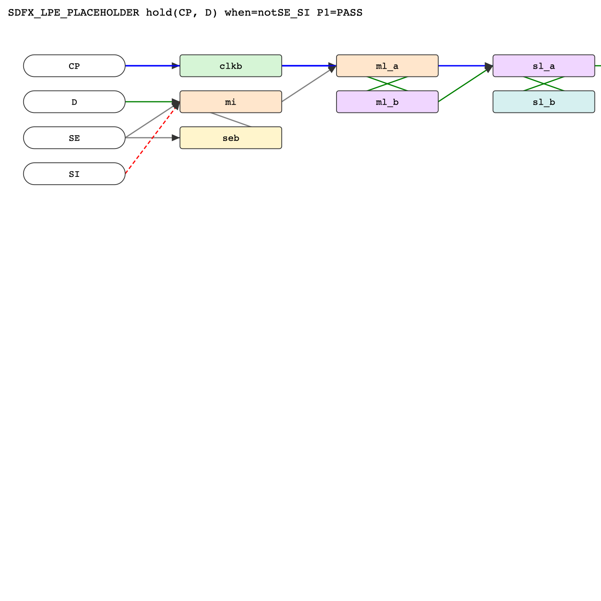

# DeckGen v2 -- Milestone Summary

*For team / manager alignment. 2026-06-04. Branch: `feat/phase-2b-engine`.*

---

## The claim we are proving

> A timing arc's **sensitization** and **initialization** can be derived
> automatically from a cell's transistor-level (LPE) topology -- **without
> cell-name rules** -- and every generated deck can carry **machine-checkable
> evidence** that the setup is correct.

## Why it matters (vs. the incumbent MCQC flow)

MCQC encodes sensitization and initialization as ~850 cell-name pattern rules
plus fixed per-arc templates. Three structural limits:

1. **Cannot handle a cell it has no rule for** -- it silently falls back to the
   closest-matching template.
2. **It looks up, it does not derive** -- the side-pin biases and initial state
   come from a name-chosen template, not from what the topology requires.
3. **It cannot prove it is right** -- there is no check that the arc was actually
   isolated or that the cell reached the intended state.

DeckGen v2 replaces *look-up-by-name* with *derive-from-topology*, and adds
*proof* (the P1/P2/P3 acceptance contract) where there was none.

## What it does

```
LPE netlist -> device graph -> CCC -> sensitization(P1) -> initialization(P2)
            -> deck -> verify(P1/P2/P3)
```

Five stages; each derives its result and carries the reason for every value, so a
single screenshot is enough to judge correctness.

## Evidence -- demonstrated on a real cell

Cell `SDFQSXG0MZD1BWP130HPNPN3P48CPD` (a scan D flip-flop), arc **hold(CP, D)**,
run on the real **LPE** netlist on the server (air-gapped):

| Stage | Result on the real cell |
|-------|-------------------------|
| **S0 parse + de-parasitic** | 181 raw nodes -> **28 logical nets** via 226 parasitic resistors; 34 transistors; **0 bridge errors**. Recovers logical connectivity from the post-layout netlist by shorting parasitic R -- no schematic/CDL needed. |
| **S1 structure** | Found master `{ml_ax, ml_b}` and slave `{sl_a, sl_bx}` cross-coupled storage **structurally, not by name** -- the derived master/slave landed exactly on the `ml_*`/`sl_*` naming. |
| **S2 sensitization (P1)** | Derived **SE=0** (select functional D), **SI masked** -> **SE=0, SI=1, identical to the golden deck** (`VSE SE 0 vss` / `VSI SI 0 vdd`) -- but derived from topology and **PROVEN** by Boolean reasoning, and it **AGREES** with the arc's `when` condition. **P1 = PASS.** |

The engine also auto-draws the cell's schematic from the netlist (data path D ->
mux -> master -> slave -> Q, scan input SI masked, clock CP -> clkb/clkbb), with
the sensitized path color-coded. `v2_schematic_example.png` shows the layout (on
the synthetic fixture; the real cell looks the same with `ml_ax`/`sl_bx` etc.) --
green = measured D path, red dashed = masked scan SI, blue = clock. Regenerate the
real-cell figure with `python -m engine.run --svg out.svg --netlist <cell>.spi`.



**The differentiator, shown on real silicon:** the same answer as MCQC
(`SE=0, SI=1`), but obtained **without any cell name** and accompanied by a
machine-checkable proof.

## Status

| Item | State |
|------|-------|
| S0 parse + R-merge de-parasitic | DONE, validated on real cell |
| S1 CCC + structural master/slave | DONE, validated on real cell |
| S2 sensitization + **P1 proof** | DONE, validated on real cell (matches golden) |
| S3 initialization derivation | DONE (master evaluated; slave polarity pending sim) |
| S4 deck assembly (golden-structured) | DONE |
| 16-arc identifier support, text + graphical visualization | DONE |
| **P2 (initial state correct)** | Derivation done; **measured-vs-derived comparison needs a SPICE run** |
| **P3 (measurement context consistent)** | Needs the same SPICE run |

## Constraints honored

- **Air-gapped:** develops on synthetic LPE fixtures; the **same code** runs on
  the server against real cells (config switch, no engine change).
- **Zero external dependencies** -- pure Python stdlib (the server forbids
  pip-from-internet); the sensitization proof uses a built-in switch-level
  Boolean engine, not an external SAT solver.
- **No real PDK** in development; generic models only.
- Deterministic; every derived value carries its derivation reason.

## Next steps

1. **Wire HSPICE into the verify loop** -> P2/P3 become real PASS/FAIL. *Needs the
   site's HSPICE invocation (e.g. `hspice deck.sp`, a wrapper, or `bsub`).* This
   closes the "provable" loop -- P2 (initial state correct) is the property the
   incumbent flow cannot provide today.
2. **Batch the cell's 16 arcs** -> a P1 coverage table.
3. **Roadmap stress cells** (sync(N) x min_pulse_width, ckgmux2 x nochange,
   retn) per the spec, to stress initialization-via-pre-cycle and sensitization
   breadth.

## Decision asked at alignment

- Confirm the direction (derive + prove vs. name-rules) is worth carrying to the
  P2 milestone.
- Clear the path to run HSPICE from the engine for the P2/P3 simulation step.
